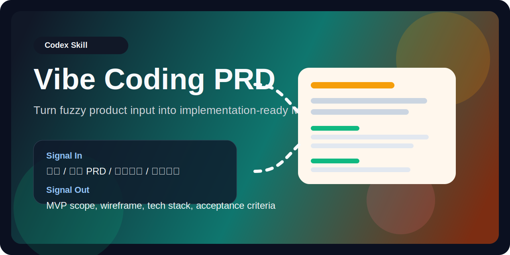
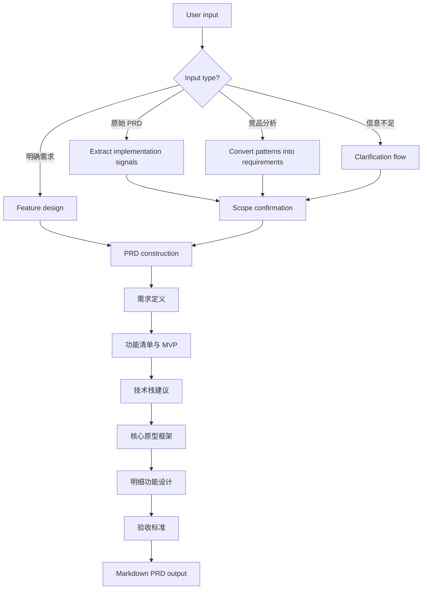

# Vibe Coding PRD

<p align="center">
  
</p>

<p align="center">
  <a href="./SKILL.md"></a>
  
  
  
</p>

Turn messy requirements into short, implementation-ready PRDs for Codex or Claude Code.

This skill is designed for teams or solo builders who want to go from fuzzy product thinking to a concise Markdown PRD that a coding agent can actually execute.

## What It Does

- Classifies incoming material as a clear requirement, raw PRD, competitor analysis, or insufficient information.
- Forces key product decisions through numbered option confirmations instead of guessing.
- Extracts only build-relevant information from long docs and collaboration links.
- Produces a compact PRD with scope, MVP, wireframe, tech stack, feature details, and acceptance criteria.
- Switches between AI-product and traditional-product PRD templates automatically after confirmation.

## Why This Skill Exists

Most raw PRDs are too long, too vague, or too business-heavy for coding agents.

This skill trims away low-signal background and keeps only the parts that matter for implementation:

- target users
- scenario
- pain point
- product shape
- scope boundaries
- workflow details
- technical constraints
- testable acceptance criteria

## Flow At A Glance



## Repo Structure

```text
.
├── SKILL.md
├── README.md
├── LICENSE
├── .gitignore
├── agents/
│   └── openai.yaml
├── references/
│   ├── prd-template-ai.md
│   ├── prd-template-traditional.md
│   └── question-flow.md
└── assets/
    └── vibe-coding-prd-banner.svg
```

## Core Design Principles

| Principle | What it means |
| --- | --- |
| No hidden guessing | The skill should stop and ask instead of inventing missing product intent. |
| Option-driven clarification | Every key node ends with 2-4 numbered choices. |
| Build-first summarization | Keep implementation detail, drop business theater. |
| Agent-friendly output | Final PRD is short, structured, and directly usable by coding agents. |
| Observable acceptance | Every acceptance criterion must be testable and action-based. |

## Included Templates

| File | Purpose |
| --- | --- |
| [`references/question-flow.md`](./references/question-flow.md) | Structured clarification prompts and confirmation patterns |
| [`references/prd-template-ai.md`](./references/prd-template-ai.md) | PRD template for AI-native or agent-based products |
| [`references/prd-template-traditional.md`](./references/prd-template-traditional.md) | PRD template for non-AI products |
| [`agents/openai.yaml`](./agents/openai.yaml) | Agent-facing display metadata |

## Best For

- Turning a rough idea into an implementation-ready spec
- Compressing a long PRD into coding-agent language
- Converting competitor research into a concrete product scope
- Preparing product requirements for Codex or Claude Code workflows

## Example Prompt

```text
使用 $vibe-coding-prd 把这份需求、原始 PRD、竞品分析或飞书链接整理成可直接交给 Claude Code 或 Codex 的精简 PRD。
```

## Final Output Shape

The skill is designed to end with only:

1. A one-line status
2. The full Markdown PRD

That keeps the output clean enough to pass directly into an implementation agent.

## Installation

Copy this repository into your Codex skills directory, for example:

```bash
mkdir -p ~/.codex/skills
cp -R vibe-coding-prd ~/.codex/skills/
```

If you already have a local version, replace it with this repository copy or merge the updated files you want.

## License

MIT
